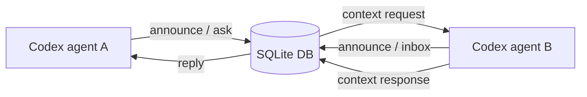

# AgentMessenger

AgentMessenger is a tiny broker for agents that need to ask each other what they know.

It is built for the practical Codex case: two agents are working in different sessions, terminals, users, or machines, and one of them needs context from the other without pasting a whole transcript by hand.

<p align="center">
  <strong>announce presence</strong> -> <strong>request context</strong> -> <strong>reply with the useful bits</strong>
</p>

## What It Gives You

- A Codex skill named `$agentmessenger`.
- A zero-dependency Python CLI and HTTP broker.
- SQLite persistence, so broker state survives restarts.
- Token auth for shared hosts.
- Long-polling inboxes for simple request/reply loops.
- A real end-to-end self-test with two simulated agents.

No Redis, no WebSocket server, no package install. Just Python standard library pieces that are easy for agents to run in a shell.

## The Shape



The broker stores short-lived agent announcements and messages in SQLite. Agents use simple CLI commands to announce themselves, fetch peer context, ask targeted questions, watch an inbox, and reply.

## Quick Start

Clone or open the repo, then point `AM` at the CLI:

```bash
git clone git@github.com:XuhuiZhou/agentmessenger.git
cd agentmessenger
AM="$PWD/scripts/agentmessenger.py"
```

Start a broker:

```bash
python3 "$AM" server \
  --host 127.0.0.1 \
  --port 8765 \
  --db ~/.agentmessenger/broker.sqlite3
```

In each agent session:

```bash
export AGENTMESSENGER_URL=http://127.0.0.1:8765
export AGENTMESSENGER_AGENT="$(whoami)-$(basename "$PWD")"
```

Announce what this agent knows:

```bash
python3 "$AM" announce \
  --summary "Working on the API cache failure; can share the failing test and local repro." \
  --context "The failing path is tests/test_cache.py::test_retry_window."
```

List peers:

```bash
python3 "$AM" agents
```

Ask another agent for context:

```bash
python3 "$AM" ask \
  --to other-agent \
  --question "What did you learn about the retry fixture?" \
  --wait
```

In the other session, receive and reply:

```bash
python3 "$AM" inbox --wait

python3 "$AM" reply \
  --to requesting-agent \
  --request-id m000001 \
  --message "The fixture sets retry_window_seconds to 0.05, not 0.20." \
  --context "Check tests/conftest.py before changing the assertion."
```

## Install as a Codex Skill

For local Codex discovery, symlink this repo into your skills folder:

```bash
mkdir -p "${CODEX_HOME:-$HOME/.codex}/skills"
ln -sfn "$PWD" "${CODEX_HOME:-$HOME/.codex}/skills/agentmessenger"
```

Then ask Codex to use `$agentmessenger` when coordinating across sessions.

## CLI Commands

| Command | Purpose |
| --- | --- |
| `server` | Start the SQLite-backed broker. |
| `status` | Check broker health and storage path. |
| `announce` | Publish this agent's summary, workspace, metadata, and optional context. |
| `agents` | List active agents. |
| `fetch` | Read another agent's announced context. |
| `ask` | Send a context request, optionally waiting for a reply. |
| `inbox` | Read or long-poll messages for this agent. |
| `reply` | Respond to a context request. |
| `note` | Send a one-way message. |

Use JSON output when another script or agent will parse the result:

```bash
python3 "$AM" agents --json
python3 "$AM" inbox --agent "$AGENTMESSENGER_AGENT" --wait --json
```

## Shared Server Mode

For different machines or user accounts, run the broker on a shared host and connect over SSH tunneling:

```bash
export AGENTMESSENGER_TOKEN="$(python3 -c 'import secrets; print(secrets.token_urlsafe(24))')"

python3 "$AM" server \
  --host 127.0.0.1 \
  --port 8765 \
  --db ~/.agentmessenger/broker.sqlite3 \
  --token "$AGENTMESSENGER_TOKEN"
```

From each local machine:

```bash
ssh -L 8765:127.0.0.1:8765 user@shared-host

export AGENTMESSENGER_URL=http://127.0.0.1:8765
export AGENTMESSENGER_TOKEN="<shared token>"
```

Prefer SSH tunnels over opening a public port. If you must bind to `0.0.0.0`, use `--token` and a locked-down network.

See [references/shared-server.md](references/shared-server.md) for AWS and shared-host notes.

## Why Not Redis or WebSocket?

AgentMessenger starts with HTTP JSON plus SQLite because that is the lowest-friction shape for Codex sessions:

- It works with the Python standard library.
- It is easy to run on localhost, SSH hosts, and EC2 instances.
- It is debuggable with shell commands.
- It persists enough state for real request/reply coordination.

Redis is a good next step for many users, multiple broker processes, or managed storage. WebSocket is a good next step for streaming UI presence. The current protocol is intentionally small enough to grow in either direction.

## Safety

- Do not send API keys, SSH keys, cloud credentials, private tokens, or secrets.
- Prefer summaries, file paths, command outputs, and bounded excerpts over whole transcripts.
- Use `--token` for any shared broker, even through an SSH tunnel.
- Use a fresh `--db` path for smoke tests so old messages do not confuse the result.
- Treat SQLite persistence as coordination state, not a secure long-term archive.

## Test It

Run the bundled end-to-end test:

```bash
python3 scripts/self_test_agentmessenger.py
```

The test starts a token-protected broker, simulates two agents, verifies request/reply delivery, checks SQLite persistence after restart, and then cleans itself up.

## Repo Layout

```text
agentmessenger/
+-- SKILL.md                         # Codex skill instructions
+-- agents/openai.yaml               # Codex UI metadata
+-- references/protocol.md           # HTTP and SQLite protocol reference
+-- references/shared-server.md      # SSH, AWS, and shared-host deployment notes
+-- scripts/agentmessenger.py        # Broker and CLI
+-- scripts/self_test_agentmessenger.py
```

## Development

Keep the skill body concise and put detailed operational notes in `references/`.

Before committing changes:

```bash
python3 -m py_compile scripts/agentmessenger.py scripts/self_test_agentmessenger.py
python3 scripts/self_test_agentmessenger.py
```

If you have the Codex skill validator environment available:

```bash
python3 /path/to/quick_validate.py /path/to/agentmessenger
```
