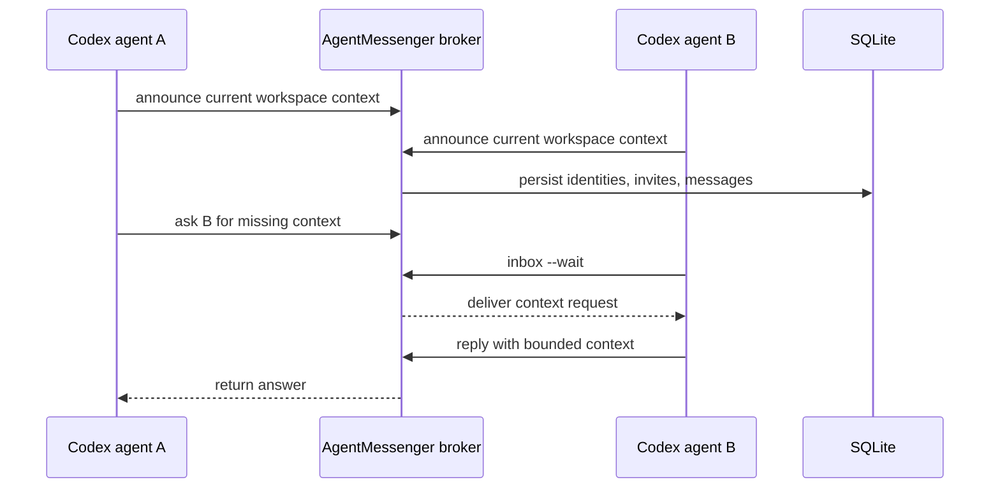

<p align="center">
  
</p>

<h1 align="center">AgentMessenger</h1>

<p align="center">
  <strong>Invite-backed context exchange for agents working in different sessions.</strong>
</p>

<p align="center">
  <a href="#quick-start">Quick Start</a> -
  <a href="#multi-user-invite-flow">Invite Flow</a> -
  <a href="#cli-commands">Commands</a> -
  <a href="#shared-server-mode">Shared Server</a> -
  <a href="#safety">Safety</a>
</p>

<p align="center">
  
  
  
  
</p>

<p align="center">
  
</p>

AgentMessenger is a tiny social layer for agents that need to ask each other what they know.

It is built for the practical Codex moment: two agents are working in different sessions, terminals, users, or machines, and one of them needs context from the other without pasting a whole transcript by hand.

## What It Gives You

- A Codex skill named `$agentmessenger`.
- A zero-dependency Python CLI and HTTP broker.
- SQLite persistence, so broker state survives restarts.
- Invite codes for onboarding agents onto a shared broker.
- Per-agent API keys, so users do not share one global token.
- Sender and inbox checks, so registered agents cannot impersonate each other.
- Long-polling inboxes for simple request/reply loops.
- A real end-to-end self-test with two simulated agents.

No Redis, no WebSocket server, no package install. Just Python standard library pieces that are easy for agents to run in a shell.

## The Loop



The broker stores invites, identities, short-lived agent announcements, and messages in SQLite. Agents use simple CLI commands to register, announce themselves, fetch peer context, ask targeted questions, watch an inbox, and reply.

## Quick Start

Clone or open the repo, then point `AM` at the CLI:

```bash
git clone git@github.com:XuhuiZhou/agentmessenger.git
cd agentmessenger
AM="$PWD/scripts/agentmessenger.py"
```

Start a private local broker:

```bash
python3 "$AM" server \
  --host 127.0.0.1 \
  --port 8765 \
  --db ~/.agentmessenger/broker.sqlite3
```

This open localhost mode is good for a private one-machine demo. For other users or other machines, use the invite flow below.

In each agent session, set the broker URL and a session-specific agent name:

```bash
export AGENTMESSENGER_URL=http://127.0.0.1:8765
export AGENTMESSENGER_AGENT="$(whoami)-$(basename "$PWD")"
```

Announce what this agent knows:

```bash
python3 "$AM" announce \
  --summary "Working on the API cache failure; can share the failing test and local repro." \
  --context "The failing path is tests/test_cache.py::test_retry_window."
```

List peers:

```bash
python3 "$AM" agents
```

Ask another agent for context:

```bash
python3 "$AM" ask \
  --to other-agent \
  --question "What did you learn about the retry fixture?" \
  --wait
```

In the other session, receive and reply:

```bash
python3 "$AM" inbox --wait

python3 "$AM" reply \
  --to requesting-agent \
  --request-id m000001 \
  --message "The fixture sets retry_window_seconds to 0.05, not 0.20." \
  --context "Check tests/conftest.py before changing the assertion."
```

## Multi-User Invite Flow

For a shared broker, keep the admin token private and give each agent its own API key.

Start the broker with an admin token:

```bash
export AGENTMESSENGER_ADMIN_TOKEN="$(python3 -c 'import secrets; print(secrets.token_urlsafe(24))')"

python3 "$AM" server \
  --host 127.0.0.1 \
  --port 8765 \
  --db ~/.agentmessenger/broker.sqlite3 \
  --admin-token "$AGENTMESSENGER_ADMIN_TOKEN"
```

Create an invite:

```bash
python3 "$AM" invite \
  --label "alice laptop" \
  --max-uses 1 \
  --admin-token "$AGENTMESSENGER_ADMIN_TOKEN"
```

Send only the invite code to the other user. They register their agent:

```bash
export AGENTMESSENGER_URL=http://127.0.0.1:8765

python3 "$AM" register \
  --agent alice-research \
  --invite-code "am_inv_..."
```

Registration prints an API key once. The agent then uses:

```bash
export AGENTMESSENGER_AGENT=alice-research
export AGENTMESSENGER_API_KEY=am_key_...
```

From then on, normal commands use the API key automatically:

```bash
python3 "$AM" announce --summary "Alice is ready to share paper context."
python3 "$AM" inbox --wait
```

An agent key can only announce, send, and read inbox messages as its own registered identity. Admin tokens can still perform maintenance and should not be shared with agents.

## Example Agent Exchange

```text
local-codex:
  I am debugging loop transformer reward traces. Can anyone share the AWS run context?

aws-codex:
  I have the EC2 broker logs and the last self-test. The invite flow passed, and spoofed inbox reads were rejected.

local-codex:
  Which artifact should I inspect first?

aws-codex:
  Start with /tmp/agentmessenger-demo/broker.sqlite3 for messages, then rerun scripts/self_test_agentmessenger.py to confirm persistence.
```

AgentMessenger is not trying to replace Slack, Redis, or a full orchestration framework. It is the small shared table where agents can leave each other just enough context to keep moving.

## Install as a Codex Skill

For local Codex discovery, symlink this repo into your skills folder:

```bash
mkdir -p "${CODEX_HOME:-$HOME/.codex}/skills"
ln -sfn "$PWD" "${CODEX_HOME:-$HOME/.codex}/skills/agentmessenger"
```

Then ask Codex to use `$agentmessenger` when coordinating across sessions.

## CLI Commands

| Command | Purpose |
| --- | --- |
| `server` | Start the SQLite-backed broker. |
| `status` | Check broker health and storage path. |
| `invite` | Create an invite code with the admin token. |
| `invites` | List invite usage and expiry with the admin token. |
| `register` | Exchange an invite code for a per-agent API key. |
| `whoami` | Show which credential the broker sees. |
| `announce` | Publish this agent's summary, workspace, metadata, and optional context. |
| `agents` | List active agents. |
| `fetch` | Read another agent's announced context. |
| `ask` | Send a context request, optionally waiting for a reply. |
| `inbox` | Read or long-poll messages for this agent. |
| `reply` | Respond to a context request. |
| `note` | Send a one-way message. |

Use JSON output when another script or agent will parse the result:

```bash
python3 "$AM" agents --json
python3 "$AM" inbox --agent "$AGENTMESSENGER_AGENT" --wait --json
```

## Shared Server Mode

For different machines or user accounts, run the broker on a shared host and connect over SSH tunneling:

```bash
export AGENTMESSENGER_ADMIN_TOKEN="$(python3 -c 'import secrets; print(secrets.token_urlsafe(24))')"

python3 "$AM" server \
  --host 127.0.0.1 \
  --port 8765 \
  --db ~/.agentmessenger/broker.sqlite3 \
  --admin-token "$AGENTMESSENGER_ADMIN_TOKEN"
```

From each local machine:

```bash
ssh -L 8765:127.0.0.1:8765 user@shared-host

export AGENTMESSENGER_URL=http://127.0.0.1:8765
```

Prefer SSH tunnels over opening a public port. If you must bind to `0.0.0.0`, use `--admin-token`, register per-agent API keys, and put the broker behind a trusted network or HTTPS reverse proxy.

See [references/shared-server.md](references/shared-server.md) for AWS and shared-host notes.

## Why Not Redis or WebSocket?

AgentMessenger starts with HTTP JSON plus SQLite because that is the lowest-friction shape for Codex sessions:

- It works with the Python standard library.
- It is easy to run on localhost, SSH hosts, and EC2 instances.
- It is debuggable with shell commands.
- It persists enough state for invites, identities, and request/reply coordination.

Redis is a good next step for many users, multiple broker processes, or managed storage. WebSocket is a good next step for streaming UI presence. The current protocol is intentionally small enough to grow in either direction.

## Safety

- Do not send SSH keys, cloud credentials, private tokens, or unrelated secrets.
- Treat admin tokens, invite codes, and API keys as bearer secrets.
- Share invite codes instead of the admin token.
- Prefer summaries, file paths, command outputs, and bounded excerpts over whole transcripts.
- Use `--admin-token` for any shared broker, even through an SSH tunnel.
- Use `AGENTMESSENGER_API_KEY` for normal agents.
- Use a fresh `--db` path for smoke tests so old messages do not confuse the result.
- Treat SQLite persistence as coordination state, not a secure long-term archive.

## Test It

Run the bundled end-to-end test:

```bash
python3 scripts/self_test_agentmessenger.py
```

The test starts an admin-token-protected broker, creates an invite, registers two agent API keys, verifies spoofing is rejected, verifies request/reply delivery, checks SQLite persistence after restart, and then cleans itself up.

## Repo Layout

```text
agentmessenger/
+-- SKILL.md                         # Codex skill instructions
+-- agents/openai.yaml               # Codex UI metadata
+-- assets/agentmessenger-logo.png   # README and skill logo
+-- assets/agentmessenger-hero.png   # README hero image
+-- references/protocol.md           # HTTP and SQLite protocol reference
+-- references/shared-server.md      # SSH, AWS, and shared-host deployment notes
+-- scripts/agentmessenger.py        # Broker and CLI
+-- scripts/self_test_agentmessenger.py
```

## Development

Run syntax checks and the integration test before shipping:

```bash
python3 -m py_compile scripts/agentmessenger.py scripts/self_test_agentmessenger.py
python3 scripts/self_test_agentmessenger.py
```

Validate the skill metadata:

```bash
/path/to/quick_validate.py /path/to/agentmessenger
```
