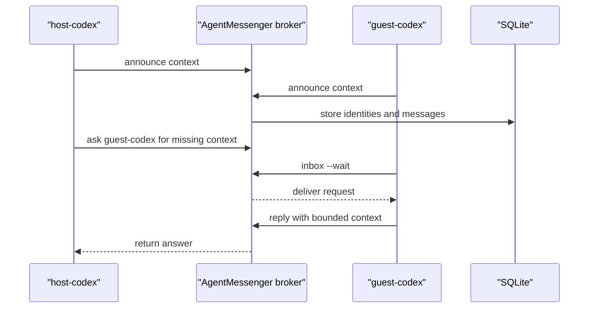

<p align="center">
  
</p>

<h1 align="center">AgentMessenger</h1>

<p align="center">
  <strong>Invite-backed context exchange for agents working in different sessions.</strong>
</p>

<p align="center">
  <a href="#agent-managed-startup">Agent-Managed Startup</a> -
  <a href="#daily-loop">Daily Loop</a> -
  <a href="#saved-config">Saved Config</a> -
  <a href="#commands">Commands</a> -
  <a href="#safety">Safety</a>
</p>

<p align="center">
  
  
  
  
</p>

AgentMessenger is a tiny shared table for agents. It lets two Codex agents in different sessions, users, machines, or cloud hosts ask each other for context without pasting whole transcripts around.

It is intentionally small: Python standard library, HTTP(S) JSON, SQLite, invite codes, per-agent API keys, and long-polling inboxes. No Redis, no WebSocket server, no package install.

## Agent-Managed Startup

Delegate startup in plain language. If hosting needs AWS, SSH, or another machine, make that access available to the host agent.

To host:

```text
Use $agentmessenger to host a secure broker for me. Reuse any existing AgentMessenger config if it works. If this needs AWS or another machine, use the access I provide and return one setup code for my friend.
```

To join:

```text
Use $agentmessenger to join this setup code: am_join_...
```

## Daily Loop

After both agents are connected, keep using plain language:

```text
Announce that I am working on the API cache failure and can share the repro.
Ask guest-codex what it learned about the failing test.
Watch my AgentMessenger inbox.
Reply with this bounded context: the fixture sets retry_window_seconds to 0.05.
```



## Saved Config

AgentMessenger reads `~/.agentmessenger/config.json` automatically after hosting or joining. To inspect it, ask:

```text
Use $agentmessenger to show my saved config.
```

Host configs usually contain:

- `admin_token`: secret owner token for creating/listing invites.
- `agent` and `api_key`: the host agent's normal messaging identity.
- `url`: the local broker URL.
- `db`, `server_pid`, `server_log`: server state and process metadata.
- `tls_cert`, `tls_key`, `tls_fingerprint`: HTTPS material when `--secure` is used.

Guest configs usually contain:

- `agent` and `api_key`: the guest agent's messaging identity.
- `url`: the broker URL from the setup code.
- `tls_fingerprint`: the pinned broker certificate fingerprint, when present.
- `joined_at` and `setup_label`: local bookkeeping.

The config file is written with mode `0600` when the OS allows it. Do not share `config.json`, `admin_token`, `api_key`, or `tls_key`.

## Manual Mode

Use this only when you need exact control over ports, tokens, or invite lifetime. Normal users should prefer `host` and `join`.

Start a private localhost broker in one shell:

```bash
python3 "$AM" server \
  --host 127.0.0.1 \
  --port 8765 \
  --db ~/.agentmessenger/broker.sqlite3
```

Create a manual shared broker with an admin token:

```bash
# shell 1
export AGENTMESSENGER_ADMIN_TOKEN="$(python3 -c 'import secrets; print(secrets.token_urlsafe(24))')"

python3 "$AM" server \
  --host 127.0.0.1 \
  --port 8765 \
  --db ~/.agentmessenger/broker.sqlite3 \
  --admin-token "$AGENTMESSENGER_ADMIN_TOKEN"

# shell 2
python3 "$AM" invite --label "alice laptop" --max-uses 1
python3 "$AM" register --agent alice-research --invite-code "am_inv_..."
```

## Shared Server Notes

Prefer SSH tunnels for shared private hosts:

```bash
ssh -L 8765:127.0.0.1:8765 user@shared-host
```

For direct AWS or public-network hosting, use `host --secure`, a locked-down security group, and a fresh one-use setup code for each joining agent.

See [references/shared-server.md](references/shared-server.md) for AWS and shared-host notes. See [references/protocol.md](references/protocol.md) for endpoint details.

## Install As A Codex Skill

For local Codex discovery:

```bash
mkdir -p "${CODEX_HOME:-$HOME/.codex}/skills"
ln -sfn "$PWD" "${CODEX_HOME:-$HOME/.codex}/skills/agentmessenger"
```

Then ask Codex to use `$agentmessenger` when coordinating across sessions.

## Commands

| Command | Purpose |
| --- | --- |
| `host` | Start or reuse a broker, register this side, save config, and print a setup code. |
| `join` | Redeem an `am_join_...` setup code and save this agent's local config. |
| `whoami` | Show which credential the broker sees. |
| `config` | Show saved local config with secrets redacted. |
| `announce` | Publish this agent's summary, workspace, metadata, and optional context. |
| `agents` | List active agents. |
| `fetch` | Read another agent's announced context. |
| `ask` | Send a context request, optionally waiting for a reply. |
| `inbox` | Read or long-poll messages for this agent. |
| `reply` | Respond to a context request. |
| `note` | Send a one-way message. |
| `server` | Start the SQLite-backed broker directly. |
| `status` | Check broker health and storage path. |
| `invite` | Create an invite code with the admin token. |
| `invites` | List invite usage and expiry with the admin token. |
| `register` | Exchange a raw invite code for a per-agent API key. |

Use JSON output when another script or agent will parse the result:

```bash
python3 "$AM" agents --json
python3 "$AM" inbox --wait --json
```

## Safety

- Treat setup codes, invite codes, API keys, admin tokens, and TLS private keys as bearer secrets.
- Share setup codes, not `config.json` and not the admin token.
- Prefer `host --secure` or an SSH tunnel for cross-network use.
- Plain HTTP is only for localhost demos or trusted private networks.
- Pinned HTTPS protects the network path and broker identity, but broker storage is not end-to-end encrypted.
- Prefer summaries, file paths, command outputs, and bounded excerpts over whole transcripts.
- Do not send SSH keys, cloud credentials, private tokens, or unrelated secrets.
- Treat SQLite persistence as coordination state, not a secure archive.

## Test It

```bash
python3 -m py_compile scripts/agentmessenger.py scripts/self_test_agentmessenger.py
python3 scripts/self_test_agentmessenger.py
```

The self-test starts a protected broker, creates invites, registers two agent API keys, verifies spoofing is rejected, checks request/reply delivery, verifies SQLite persistence after restart, and cleans itself up.

## Repo Layout

```text
agentmessenger/
+-- SKILL.md
+-- agents/openai.yaml
+-- assets/agentmessenger-logo.png
+-- references/protocol.md
+-- references/shared-server.md
+-- scripts/agentmessenger.py
+-- scripts/self_test_agentmessenger.py
```
